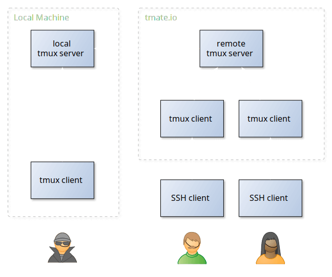
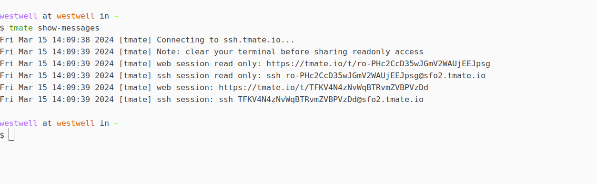

# ubuntu

>#### 本文主要用于记录日常遇到的问题及解决方法，留下备份，为下次出现提供快速的解决方法。


## Q:如何设置磁盘的自动挂载？

```shell
A：
1.使用命令查看分区
sudo fdisk -l  
2.创建挂载目录
sudo mkdir /mnt/data
3.开始挂载
sudo mount /dev/sda/ /mnt/data/
4.设置开机自动挂载
4.1查询挂载硬盘UUID
sudo blkid /dev/sda2
返回信息为
/dev/sda2: LABEL="Data" UUID="88069947069936E2" TYPE="ntfs" 
PARTLABEL="Basic data partition" PARTUUID="7170f9a7-9c9f-43d8-
9916-da47aa9101f7"
格式化硬盘文件类型：
sudo mkfs.ext4 /dev/xxxxx 
4.2修改文件
打开文件/etc/fstab文件。
sudo gedit /etc/fstab
在文档末尾添加裹在磁盘的信息。
格式为：
[UUID=************] [挂载磁盘分区]  [挂载磁盘格式]  0  2
UUID=88069947069936E2 /mnt/data ntfs defaults  0  2
第一个数字：0表示开机不检查磁盘，1表示开机检查磁盘；
第二个数字：0表示交换分区，1代表启动分区（Linux），2表示普通分区
我挂载的分区是在WIn系统下创建的分区，磁盘格式为ntfs
 
请注意：如若改错，无法进入桌面，系统无法系统，意味着系统崩溃！请再三核对！否则只有重新安装系统!!       #谨慎操作
# 详细解释
第一列可以是实际分区名，也可以是实际分区的卷标（Lable）。
如果磁盘是SATA接口，且有多个磁盘，则每个磁盘被标记为 /dev/hda 、 /dev/hdb、 /dev/hdc 等以此类推；而每个磁盘的分区被标记为 /dev/hda1、 /dev/hda2等。
如果磁盘是SCSI类型，则多个磁盘会被分别标记为 /dev/sda、/dev/sdb等等。分区同理。

第二列是挂载点。
挂载点必须为当前已经存在的目录，为了兼容起见，最好在创建需要挂载的目标目录后，将其权限设置为777，以开放所有权限。

第三列为此分区的文件系统类型。
Linux可以使用ext2、ext3等类型，此字段须与分区格式化时使用的类型相同。也可以使用 auto 这一特殊的语法，使系统自动侦测目标分区的分区类型。auto通常用于可移动设备的挂载。

第四列是挂载的选项，用于设置挂载的参数。
常见参数如下：
auto: 系统自动挂载，fstab默认就是这个选项
defaults: rw, suid, dev, exec, auto, nouser, and async.
noauto 开机不自动挂载
nouser 只有超级用户可以挂载
ro 按只读权限挂载
rw 按可读可写权限挂载
user 任何用户都可以挂载
请注意光驱和软驱只有在装有介质时才可以进行挂载，因此它是noauto

第五列是dump备份设置。
当其值设置为1时，将允许dump备份程序备份；设置为0时，忽略备份操作；

第六列是fsck磁盘检查设置。
其值是一个顺序。当其值为0时，永远不检查；而 / 根目录分区永远都为1。其它分区从2开始，数字越小越先检查，如果两个分区的数字相同，则同时检查。
当修改完此文件并保存后，重启服务器生效。
```

## Q:如何实现rsync 断点续传

```shell
# rsync -P --rsh=ssh pic.tar.gz 192.168.205.304:/home/199_home.tar

说明：
-P: 是包含了 "–partial –progress"， 部分传送和显示进度
-rsh=ssh 表示使用ssh协议传送数据
```

## 	Q:显卡及显卡驱动

```bash
## 查看显卡驱动信息
nvidia-smi  

## 查看显卡信息

ubuntu-drives devices 

## 查看显卡信息 （已安装显卡驱动）
nvidia-smi -L 
```


## Q:ps

```bash
# 查看指定进程
ps -aux |grep <pid>/<program_name>
# 查看假死进程
ps -axjf  # 查看STAT 是否有D+状态 该状态的进程无法终止，也无法自行退出。只能通过恢复其依赖的资源或者重启系统来解决
```


## Q:tcpdump

```bash
> tcpdump 
# 默认抓取 第一个网络接口上的所有的数据包。
#第一列： 
时间 ： 21：25：39.013621
#第二列：
网络协议 IP
#第三列
发送方的ip地址+端口 ，其中 ssh 是协议，22端口
#第四列
箭头>,表示数据流向
#第五列
接收方的ip地址+端口
#第六列
数据包内容，包括Flags标识符，seq号，ack号，win窗口，数据长度length,其中[p.]表示PUSH标志位为1


# man tcpdump
抓包选项：
-c：指定要抓取的包数量。

-i interface：指定tcpdump需要监听的接口。默认会抓取第一个网络接口

-n：对地址以数字方式显式，否则显式为主机名，也就是说-n选项不做主机名解析。

-nn：除了-n的作用外，还把端口显示为数值，否则显示端口服务名。

-P：指定要抓取的包是流入还是流出的包。可以给定的值为"in"、"out"和"inout"，默认为"inout"。

-s len：设置tcpdump的数据包抓取长度为len，如果不设置默认将会是65535字节。对于要抓取的数据包较大时，长度设置不够可能会产生包截断，若出现包截断，
：输出行中会出现"[|proto]"的标志(proto实际会显示为协议名)。但是抓取len越长，包的处理时间越长，并且会减少tcpdump可缓存的数据包的数量，
：从而会导致数据包的丢失，所以在能抓取我们想要的包的前提下，抓取长度越小越好。

输出选项：
-e：输出的每行中都将包括数据链路层头部信息，例如源MAC和目标MAC。

-q：快速打印输出。即打印很少的协议相关信息，从而输出行都比较简短。

-X：输出包的头部数据，会以16进制和ASCII两种方式同时输出。

-XX：输出包的头部数据，会以16进制和ASCII两种方式同时输出，更详细。

-v：当分析和打印的时候，产生详细的输出。

-vv：产生比-v更详细的输出。
-vvv：产生比-vv更详细的输出。

其他功能性选项：
-D：列出可用于抓包的接口。将会列出接口的数值编号和接口名，它们都可以用于"-i"后。

-F：从文件中读取抓包的表达式。若使用该选项，则命令行中给定的其他表达式都将失效。

-w：将抓包数据输出到文件中而不是标准输出。可以同时配合"-G

time"选项使得输出文件每time秒就自动切换到另一个文件。可通过"-r"选项载入这些文件以进行分析和打印。

-r：从给定的数据包文件中读取数据。使用"-"表示从标准输入中读取。


# 常用方式
监听指定网卡
sudo tcpdump -i xx 
监听指定网段并且只抓取10个包
sudo tcpdump -i xx -c 10 net 192.168
数据保留为pcap
sudo tcpdump -i xx -w file_name.pcap
监听所有网卡及设置文件大小及文件个数
sudo tcpdump -i any -C 1 -W 10 -w file_name          # -C 文件大小（MB） -W 文件个数
抓取单向数据
sudo tcpdump src/dst host 192.168.xx.xx              # src 源  dst目的
显示数据链路层的信息
sudo tcpdump -e 
过滤一系列端口
sudo tcpdump portrange 80-10000
查看包内的内容已ASCII码打印
sudo tcpdump -i <interface>  -vvv -nnA
```

## Q:iftop

```bash
界面相关说明：
中间的<= =>这两个左右箭头，表示的是流量的方向。

TX：发送流量
RX：接收流量
TOTAL：总流量
Cumm：运行iftop到目前时间的总流量
peak：流量峰值
rates：分别表示过去 2s 10s 40s 的平均流量
常用参数：
-i设定监测的网卡，如：# iftop -i eth1
-B 以bytes为单位显示流量(默认是bits)，如：# iftop -B
-n使host信息默认直接都显示IP，如：# iftop -n
-N使端口信息默认直接都显示端口号，如: # iftop -N
-F显示特定网段的进出流量，如# iftop -F 10.10.1.0/24或# iftop -F 10.10.1.0/255.255.255.0
-h（display this message），帮助，显示参数信息
-p使用这个参数后，中间的列表显示的本地主机信息，出现了本机以外的IP信息;
-b使流量图形条默认就显示;
-f这个暂时还不太会用，过滤计算包用的;
-P使host信息及端口信息默认就都显示;
-m设置界面最上边的刻度的最大值，刻度分五个大段显示，例：# iftop -m 100M
其余参考资料： https://www.vpser.net/manage/iftop.html
```


## Q:iperf

>
>
>Iperf 是一个网络性能测试工具。Iperf可以测试TCP和UDP带宽质量。Iperf可以测量最大TCP带宽，具有多种参数和UDP特性。Iperf可以报告带宽，延迟抖动和数据包丢失。所以三种协议（udp.tcp，icmp）可以用iperf测试


>**TCP**
>
>测量网络带宽
>
>报告MSS/MTU值的大小和观测值
>
>支持TCP窗口值通过套接字缓冲
>
>当P线程或Win32线程可用时，支持多线程。客户端与服务端支持同时多重连接
>
>
>
>**UDP**
>
>客户端可以创建指定带宽的UDP流
>
>测量丢包
>
>测量延迟
>
>支持多播

安装： sudo apt update ;sudo apt install iperf

```bash
参数说明：
-s ：以server模式启动，iperf -s
-c host ： 以client模式启动，host是server端ip，iperf -c 222.35.11.23
通用参数：
-f [kmKM] 分别表示以Kbits, Mbits, KBytes, MBytes显示报告，默认以Mbits为单位,
-i sec 以秒为单位显示报告间隔
-l 缓冲区大小，默认是8KB,
-m 显示tcp最大mtu值
-o 将报告和错误信息输出到文件
-p 指定服务器端使用的端口或客户端所连接的端口
-u 使用udp协议
-w 指定TCP窗口大小，默认是8KB
-B 绑定一个主机地址或接口（当主机有多个地址或接口时使用该参数）
-C 兼容旧版本（当server端和client端版本不一样时使用）
-M 设定TCP数据包的最大mtu值
-N 设定TCP不延时
-V 传输ipv6数据包

server 专用参数说明：
-D 以服务方式运行。
-R 停止iperf服务。针对-D
client 专用参数：
-d 同时进行双向传输测试
-n 指定传输的字节数，
-r 单独进行双向传输测试
-t 测试时间，默认20秒,
-F 指定需要传输的文件
-T 指定ttl值

udp 举例： 
server ：iperf -u -s         # iperf server 启动监听udp                   
client : iperf -c 10.182.83.13 -u -b 600m    # iperf cilent -c ip -u udp方式 -b 600m  最大发送带宽600M
举例2：
cilent : iperf -u -c 10.12.23.47 -p 8080 -l 1380  -B 10.12.32.45 -t 10 -i 1 -b 200M
参数解释：
1) 测试对端是10.12.23.47
2) 测试对端的端口是8080
3) 数据包大小是1380个字节
4) 绑定本地网卡10.12.32.45
5) 测试持续10秒钟
6) 每隔1秒钟打印一次信息
7) 最大发送带宽200M
server : iperf -s -u -i 1 -p 8080 -l 1380
```


## Q:nmap 

## Q:mcjoin

## Q:dig 
>
>
>dig 命令主要用于 查询单个主机的信息 (DNS)
```bash
> dig baidu.com

; <<>> DiG 9.16.1-Ubuntu <<>> www.baidu.com
;; global options: +cmd

;; Got answer:
;; ->>HEADER<<- opcode: QUERY, status: NOERROR, id: 51219
;; flags: qr rd ra; QUERY: 1, ANSWER: 3, AUTHORITY: 0, ADDITIONAL: 1

;; OPT PSEUDOSECTION:
; EDNS: version: 0, flags:; udp: 65494
;; QUESTION SECTION:
;www.baidu.com.			IN	A

;; ANSWER SECTION:
www.baidu.com.		548	IN	CNAME	www.a.shifen.com.
www.a.shifen.com.	218	IN	A	36.152.44.96
www.a.shifen.com.	218	IN	A	36.152.44.95

;; Query time: 12 msec
;; SERVER: 127.0.0.53#53(127.0.0.53)
;; WHEN: 四 4月 27 22:44:37 CST 2023
;; MSG SIZE  rcvd: 101
------------------------------------------------------------------------
dig 命令默认的输出信息比较丰富，大概可以分为 5 个部分。
第一部分显示 dig 命令的版本和输入的参数。
第二部分显示服务返回的一些技术详情，比较重要的是 status。如果 status 的值为 NOERROR 则说明本次查询成功结束。
第三部分中的 "QUESTION SECTION" 显示我们要查询的域名。
第四部分的 "ANSWER SECTION" 是查询到的结果。
第五部分则是本次查询的一些统计信息，比如用了多长时间，查询了哪个 DNS 服务器，在什么时间进行的查询等等。
默认情况下 dig 命令查询 A 记录，上图中显示的 A 即说明查询的记录类型为 A 记录。在尝试查询其它类型的记录前让我们先来了解一下常见的 DNS 记录类型。
```
- #### 常见 DNS 记录的类型

| 类型  | 目的                                                         |
| ----- | ------------------------------------------------------------ |
| A     | 地址记录，用来指定域名的 IPv4 地址，如果需要将域名指向一个 IP 地址，就需要添加 A 记录。 |
| AAAA  | 用来指定主机名(或域名)对应的 IPv6 地址记录。                 |
| CNAME | 如果需要将域名指向另一个域名，再由另一个域名提供 ip 地址，就需要添加 CNAME 记录。 |
| MX    | 如果需要设置邮箱，让邮箱能够收到邮件，需要添加 MX 记录。     |
| NS    | 域名服务器记录，如果需要把子域名交给其他 DNS 服务器解析，就需要添加 NS 记录。 |
| SOA   | SOA 这种记录是所有区域性文件中的强制性记录。它必须是一个文件中的第一个记录。 |
| TXT   | 可以写任何东西，长度限制为 255。绝大多数的 TXT记录是用来做 SPF 记录(反垃圾邮件)。 |

- 查询 CNAME 类型的记录

>举例

```bash
> dig agc.filterinto.com CHAME

; <<>> DiG 9.16.1-Ubuntu <<>> agc.filterinto.com CHAME
;; global options: +cmd
;; Got answer:
;; ->>HEADER<<- opcode: QUERY, status: NXDOMAIN, id: 41919
;; flags: qr rd ra; QUERY: 1, ANSWER: 0, AUTHORITY: 0, ADDITIONAL: 1

;; OPT PSEUDOSECTION:
; EDNS: version: 0, flags:; udp: 65494
;; QUESTION SECTION:
;agc.filterinto.com.		IN	A

;; Query time: 1280 msec
;; SERVER: 127.0.0.53#53(127.0.0.53)
;; WHEN: 四 4月 27 22:49:56 CST 2023
;; MSG SIZE  rcvd: 47

;; Got answer:
;; ->>HEADER<<- opcode: QUERY, status: SERVFAIL, id: 44189
;; flags: qr rd ra; QUERY: 1, ANSWER: 0, AUTHORITY: 0, ADDITIONAL: 1

;; OPT PSEUDOSECTION:
; EDNS: version: 0, flags:; udp: 65494
;; QUESTION SECTION:
;CHAME.				IN	A

;; Query time: 0 msec
;; SERVER: 127.0.0.53#53(127.0.0.53)
;; WHEN: 四 4月 27 22:49:56 CST 2023
;; MSG SIZE  rcvd: 34
# 这样结果中就只有 CNAME 的记录。其实我们可以在查询中指定任何 DNS 记录的类型。
```

- 反向查询

在前面的查询中我们指定了查询服务器为 8.8.8.8，这是谁家的 DNS 服务器？其实我们可以使用 dig 的 -x 选项来反向解析 IP 地址对应的域名：

```
$ dig -x 8.8.8.8 +short
dns.google.
```

好吧，应该是谷歌家的，可以放心使用了。


## Q:限制cpu核数

- #### MD5SUM /dev/zero

```bash
> sudo md5sum /dev/zero & 
```

- #### stress

```bahs 
stress --cpu 2  # 限制的核数
```

- ####  屏蔽cpu

某些虚拟化环境允许在运行虚拟机的同时添加或去除 CPU。

要安全去除 CPU，请先执行以下命令以停用这些 CPU

```
root # echo 0 > /sys/devices/system/cpu/cpuX/online
```

COPY

请将 *X* 替换为 CPU 编号。要使 CPU 重新联机，请执行

```
root # echo 1 > /sys/devices/system/cpu/cpuX/online
```

## Q:查看文件夹的创建时间

- #### stat

1. stat filename /dir   //       ls -i filename 

1. 获取文件inode号 

- #### df -h 

1. df -Th 
2. 找到对应的磁盘

- ####  debugfs

1. sudo debugfs -R 'stat  <Inode>'  /dev/device

2. crtime 为创建的时间

   

## Q:脚本自动传参 tab补全

template

>complete   : https://www.jianshu.com/p/aa140acbfa62
>
>sudo apt install bash-completion

```bash
# demo.sh
#!/bin/bash

case "$1:$2:$3" in 
edit:test2-2:)
    echo "ok !!!!!!!!!!!"
;;
info::)
    echo "info"
;;
gateway::)
    echo "gateway"
;;
test:test1-3:)
	echo "test ok !!!!!!"
;;
esac 
```

```bash
# tools         save path : /etc/bash-completion.d/
#!/bin/bash

function _test_tools(){
        case $COMP_CWORD in
        1)
                COMPREPLY=($(compgen -W "info gateway edit test" -- ${COMP_WORDS[COMP_CWORD]}))
                ;;
        2)
                if [[ ${COMP_WORDS[1]} == "test" ]];then
                COMPREPLY=($(compgen -W "test1-1 test1-2 test1-3" -- ${COMP_WORDS[COMP_CWORD]}))
                fi
                if [[ ${COMP_WORDS[1]} == "edit" ]];then
                COMPREPLY=($(compgen -W "test2-1 test2-2 test2-3 test2-4" -- ${COMP_WORDS[COMP_CWORD]}))
                fi
                ;;
        esac
}

complete -F _test_tools demo.sh
```

other cfg   # add auto source 

```bash
# vim ~/.bashrc or .zshrc
for i in $(ls /etc/bash_completion.d/)
do
        . /etc/bash_completion.d/$i
done
```

## Q:C++编译保留coredump文件

```bash
> ulimit -c  
0表示没有打开，unlimited表示不限制产生文件大小   
# ulimit -c unlimited  打开core文件生成且不限制    ulimit -c 4194304(示例设置2G，单位为kbyte)
临时修改：
修改/proc/sys/kernel/core_pattern文件，但/proc目录本身是动态加载的，每次系统重启都会重新加载，因此这种方法只能作为临时修改
> echo /tmp/corefile/core-%e-%p-%t > /proc/sys/kernel/core_pattern
永久修改：
> vim /etc/sysctl.conf
'kernel.core_pattern = /tmp/corefile/core-%e-%p-%t'
'kernel.core_uses_pid = 0'
# 添加这两行 
#kernel.core_uses_pid 这个参数控制core文件的文件名是否添加pid作为扩展，如果这个文件的内容被配置成1，即使core_pattern中没有设置%p，最后生成的core dump文件名仍会加上进程ID
> sysctl –p /etc/sysctl.conf   # 使生效

参数list:
%p - insert pid into filename 添加pid(进程id)
%u - insert current uid into filename 添加当前uid(用户id)
%g - insert current gid into filename 添加当前gid(用户组id)
%s - insert signal that caused the coredump into the filename 添加导致产生core的信号
%t - insert UNIX time that the coredump occurred into filename 添加core文件生成时的unix时间
%h - insert hostname where the coredump happened into filename 添加主机名
%e - insert coredumping executable name into filename 添加导致产生core的命令名
```

## Q:**GDB**

```c++
gdb ./a.out coredump.xxxx  
    // gdb /opt/qomolo/qpilot/lib/local_planner_node/local_planner_node core.local_planner_n.1567.1679621749.6
bt //显示堆栈
info thread   // 显示线程
thread apply all bt   // 显示所有线程堆栈 
thread n 切换线程
p（print） 打印变量
n (next)执行下一句（把子函数整个作为一步）， s(step) 执行下一句（函数则进入函数中）
finish 执行完当前函数
###### 日志保留
    > set logging file filename 
    > set logging on    # start
    > thread apply all bt   # cmd 
    > xxxxxxxx
    > set logging off   # end 
```

## Q:ntp deploy

>遵循网络时间协议(NTP) 规范，该规范要求使用**UDP 端口123** 进行所有时间同步。 计算机同步其时钟或向另一台计算机提供时间时，该同步在UDP 端口123 上进行

```bash
sudo apt install ntp 
sudo vim /etc/ntp.conf
#系统时间与BIOS事件的偏差记录
driftfile /var/lib/ntp/drift

restrict default kod nomodify notrap nopeer noquery    # 拒绝所有IPv4的client连接此NTP服务器
restrict -6 default kod nomodify notrap nopeer noquery    # 拒绝所有IPv6的client连接此NTP服务器


restrict 127.0.0.1    # 放行本机localhost对NTP服务的访问
restrict -6 ::1


# Hosts on local network are less restricted.
#restrict 192.168.1.0 mask 255.255.255.0 nomodify notrap    # 放行192.168.1.0网段主机与NTP服务器进行时间同步

# Use public servers from the pool.ntp.org project.
# Please consider joining the pool (http://www.pool.ntp.org/join.html).

server 0.centos.pool.ntp.org iburst    # 代表的同步时间服务器
server 1.centos.pool.ntp.org iburst
server 2.centos.pool.ntp.org iburst
server 3.centos.pool.ntp.org iburst

利用restrict 来管理权限控制
Restrict [IP] mask [netmask_IP] [parameter]

Parameter 的
ignore :拒绝所有类型的NTP联机。
nomodify: 客户端不能使用ntpc与ntpq这两个程序来修改服务器的时间参数，但客户端可透过这部主机来进行网络校时；
noquery:客户端不能够使用ntpc与ntpq等指令来查询时间服务器，不提供NTP的网络校时。
notrap:不提供trap 这个运程事件登入的功能。
notrust:拒绝没有认证的客户端。
Kod:kod技术可以阻止“Kiss of Death “包对服务器的破坏。
Nopeer:不与其他同一层的NTP服务器进行时间同步。

利用server 设定上层NTP服务器，格式如下：
server [IP or hostname] [prefer]

参数主要如下：
perfer:表示优先级最高
burst ：当一个运程NTP服务器可用时，向它发送一系列的并发包进行检测。
iburst ：当一个运程NTP服务器不可用时，向它发送一系列的并发包进行检测。


sudo systemctl restart ntp 

sudo apt install ntpdate 

# debug 
sudo ntpdate -d xx.xx.xx.xx 

# sync 
sudo ntpdate -u xx.xx.xx.xx 

# info 
sudo ntpq -np 

remote ：响应这个请求的NTP服务器的名称。
refid ：NTP服务器使用的上一级ntp服务器。
st ：remote远程服务器的级别。从1-16。
t ：待定。
when ：上一次成功请求之后到现在的秒数。
poll ：本地机和远程服务器多少时间进行一次同步(单位为秒)。 在一开始运行NTP的时候这个poll值会比较小，那样和服务器同步的频率也就增加了，可以尽快调整到正确的时间范围，之后poll值会逐渐增大，同步的频率也就会相应减小。
reach ：这是一个八进制值，用来测试能否和服务器连接，每成功连接一次它的值就会增加。
delay ：从本地机发送同步要求到ntp服务器的round trip time（往返时延）。
offset ：主机通过NTP时钟同步与所同步时间源的时间偏移量，单位为毫秒（ms）。offset越接近于0,主机和ntp服务器的时间越接近。
jitter ：这是一个用来做统计的值。 它统计了在特定个连续的连接数里offset的分布情况。简单地说这个数值的绝对值越小，主机的时间就越精确。
```

## Q:工程打包为deb

```bash
deb包结构分为：DEBIAN目录 和 软件具体安装目录（如etc, usr, opt, tmp等，之后 deb 的安装会根据这个目录把文件放到到对应的目录，如 etc/file 会放到你 linux 中的 /etc 下 ）。
在 DEBIAN 目录中至少有 control 文件，还可能有 postinst(postinstallation)、postrm(postremove)、preinst(preinstallation)、prerm(preremove)、copyright (版权）、changlog （修订记录）和 conffiles 等。

control:
#
Package: mysoftware       (软件名称，中间不能有空格，支持下划线)
Version: 1               （软件版本）
Section：申明软件的类别，常见的有`utils’, `net’, `mail’, `text’, `x11′ 等；
Priority：申明软件对于系统的重要程度，如`required’, `standard’, `optional’, `extra’ 等；
Essential：申明是否是系统最基本的软件包（选项为yes/no），如果是的话，这就表明该软件是维持系统稳定和正常运行的软件包，不允许任何形式的卸载（除非进行强制性的卸载）
Architecture：软件包结构，如基于`i386′, ‘amd64’,`m68k’, `sparc’, `alpha’, `powerpc’ 等；
Source：软件包的源代码名称；
Depends：软件所依赖的其他软件包和库文件。如果是依赖多个软件包和库文件，彼此之间采用逗号隔开；
Pre-Depends：软件安装前必须安装、配置依赖性的软件包和库文件，它常常用于必须的预运行脚本需求；
Recommends：这个字段表明推荐的安装的其他软件包和库文件；
Suggests：建议安装的其他软件包和库文件。
#
######## 示例 #######
Package: mysoftware
Version: 2016-02-26
Section: free
Priority: optional
Depends: libssl.0.0.so, libstdc++2.10-glibc2.2
Suggests: Openssl
Architecture: i386
Installed-Size: 66666
Maintainer: xxx <your_email@example.com>
Provides: mysoftware
Description: just for test
                    (此处必须空一行再结束)
----------------------------------------
Package: mysoftware       （软件名称，中间不能有空格）
Version: 1                （软件版本）
Section: free             （软件类别）
Prioritt: optional        （软件对于系统的重要性）
Architecture: amd64       （软件所支持的平台架构）
Maintainer: xxx <>        （打包人和联系方式）
Description: mydeb        （对软件的描述）
　　　　　　　　　　(此处必须空一行再结束)
       
#####################

（2）postinst文件：包含了软件在进行正常目录文件拷贝到系统后，所需要执行的配置工作。
（3）prerm文件：软件卸载前需要执行的脚本。
（4）postrm文件：软件卸载后需要执行的脚本。
（5）preinst文件：软件安装前需要执行的脚本
# 目录结构： 
mydeb
|----DEBIAN                # debian 配置文件
       |-------control
       |-------postinst
       |-------postrm
|----boot                   # scripts 
       |----- mysoftware

postinst文件内容（ 软件安装完后，执行该Shell脚本，一般用来配置软件执行环境，必须以“#!/bin/sh”为首行，然后给该脚本赋予可执行权限：chmod +x postinst    
postrm文件内容（ 软件卸载后，执行该Shell脚本，一般作为清理收尾工作，必须以“#!/bin/sh”为首行，然后给该脚本赋予可执行权限：chmod +x postrm）

## 构建 deb包
> sudo dpkg-deb -b 本地文件夹 deb包名.deb 
```

- #### deb 管理命令:

```bash
# install deb 
> dpkg -i mydeb.deb 
# remove  deb
> dpkg -r mydeb
# deb yes or no install? 
> dpkg -s mysofware
# deb info 
> dpkg -c mydeb.deb 
# deb inside info 
> dpkg --info mydeb.deb
# 解压deb 中安装的文件
> dpkg -X mydeb.deb local_path
# 解压包内指定文件到 本地文件夹
> dpkg -e mydeb.deb local_path/DEBIAN
# all deb info 
> dpkg -l | grep mydeb 
# install debug msg 
> dpkg -L mydeb 
# purge dpkg 
> dpkg --purge mydeb 
```

```bash
sink: https://askubuntu.com/questions/482928/ignore-apt-get-postinstall-scripts-automatically
deb包解压拆分安装
apt-get download <package>
sudo dpkg --unpack <package>*.deb
sudo rm /var/lib/dpkg/info/<package>.postinst -f
sudo dpkg --configure <package>
sudo apt-get install -yf  #To fix dependencies
```

## Q:ssh hostname@ip 卡在expecting ssh2_msg_kex_ecdh_reply 

>##### /etc/ssh/
>
>ssh_config和sshd_config都是ssh服务器的配置文件，二者区别在于，前者是针对客户端的配置文件，后者则是针对服务端的配置文件

```bash
#### 原因：
ssh 弱加密算法漏洞导致

#### 现象:
ping ip            // right 
ssh hostname@ip    // error 
ssh -v hostname@ip 
.........
expecting ssh2_msg_kex_ecdh_reply

#### 解决方法：
1. 屏蔽arcfour,arcfour128,arcfour256等弱加密算法  
配置文件里删除若加密算法，
sudo vim /etc/ssh/ssh_config
Ciphers aes128-ctr,aes192-ctr,aes256-ctr,aes128-cbc,3des-cbc,blowfish-cbc,cast128-cbc,aes192-cbc,aes25-cbc
保存文件后重启ssh服务
systemctl restart sshd

2. ssh -c  xxx      指定一个加密算法
cat  /etc/ssh/ssh_config |grep Ciphers  
ssh -c $(cat  /etc/ssh/ssh_config |grep Ciphers | awk '{print$1}') hostname@IP

##
-c 指定ssh使用的加密算法, 默认可以使用全部算法
```

```bash
$ ssh -Q cipher
# 通过下以命令查看ssh使用了哪些ciphers
```


>参考网址：
>
>https://blog.csdn.net/weixin_47297088/article/details/117036609?spm=1001.2101.3001.6661.1&utm_medium=distribute.pc_relevant_t0.none-task-blog-2%7Edefault%7ECTRLIST%7ERate-1-117036609-blog-120504344.235%5Ev32%5Epc_relevant_default_base3&depth_1-utm_source=distribute.pc_relevant_t0.none-task-blog-2%7Edefault%7ECTRLIST%7ERate-1-117036609-blog-120504344.235%5Ev32%5Epc_relevant_default_base3&utm_relevant_index=1

## Q:liunx内核版本降级

>
>
>function1: 你不嫌麻烦的话，每次切换内核直接开机启动的时候手工切换即可，就那个开始屏幕，问你用哪个版本的 

>
>
>function2: 
>
>```bash
>step1: 
>查看已经安装的内核版本：
>$ grep menuentry /boot/grub/grub.cfg 
>menuentry 'Ubuntu' --class ubuntu --class gnu-linux --class gnu --class os $menuentry_id_option 'gnulinux-simple-9ce1b297-0f01-4513-b3f1-4b98dbe4a66f' {
>submenu 'Advanced options for Ubuntu' $menuentry_id_option 'gnulinux-advanced-9ce1b297-0f01-4513-b3f1-4b98dbe4a66f' {
>	menuentry 'Ubuntu, with Linux 4.13.0-36-generic' --class ubuntu --class gnu-linux --class gnu --class os $menuentry_id_option 'gnulinux-4.13.0-36-generic-advanced-9ce1b297-0f01-4513-b3f1-4b98dbe4a66f' {
>	menuentry 'Ubuntu, with Linux 4.13.0-36-generic (upstart)' --class ubuntu --class gnu-linux --class gnu --class os $menuentry_id_option 'gnulinux-4.13.0-36-generic-init-upstart-9ce1b297-0f01-4513-b3f1-4b98dbe4a66f' {
>	menuentry 'Ubuntu, with Linux 4.13.0-36-generic (recovery mode)' --class ubuntu --class gnu-linux --class gnu --class os $menuentry_id_option 'gnulinux-4.13.0-36-generic-recovery-9ce1b297-0f01-4513-b3f1-4b98dbe4a66f' {
>	menuentry 'Ubuntu, with Linux 4.8.0-040800-generic' --class ubuntu --class gnu-linux --class gnu --class os $menuentry_id_option 'gnulinux-4.8.0-040800-generic-advanced-9ce1b297-0f01-4513-b3f1-4b98dbe4a66f' {
>	menuentry 'Ubuntu, with Linux 4.8.0-040800-generic (upstart)' --class ubuntu --class gnu-linux --class gnu --class os $menuentry_id_option 'gnulinux-4.8.0-040800-generic-init-upstart-9ce1b297-0f01-4513-b3f1-4b98dbe4a66f' {
>	menuentry 'Ubuntu, with Linux 4.8.0-040800-generic (recovery mode)' --class ubuntu --class gnu-linux --class gnu --class os $menuentry_id_option 'gnulinux-4.8.0-040800-generic-recovery-9ce1b297-0f01-4513-b3f1-4b98dbe4a66f' {
>menuentry 'Memory test (memtest86+)' {
>menuentry 'Memory test (memtest86+, serial console 115200)' {
>
>上面我又两个内核，完整的名称是 Linux 4.8.0-040800-generic 和 4.13.0-36-generic。
>step2:
>切换内核版本：
>$ sudo vim /etc/default/grub
>找到：GRUB_DEFAULT=0，更改为下面的命令 
>GRUB_DEFAULT="Previous Linux versions>Ubuntu, with Linux 4.8.0-040800-generic"   # Linux 4.8.0-040800-generic == 你要替换的版本 
>step3:
>更新改动：
>$ sudo update-grub
>step4：
>重启设备：
>$ sudo reboot 
>```
>
>#### 禁用 kernel 自动升级
>
>查看安装内核
>
>```bash
>dpkg --list | grep linux-image
>dpkg --list | grep linux-headers
>dpkg --list | grep linux-modules
>```
>
>禁用自动更新
>
>```bash 
>vi /etc/apt/apt.conf.d/10periodic
>vi /etc/apt/apt.conf.d/20auto-upgrades
># 把文件内左右一位都改为0
>```
>
>重启设备
>
>```bash
>sudo reboot 
>```
## Q:ubuntu 硬链接与软连接

```bash
# 软链接
ln -s 文件 被创建软连接文件
选项：
-s：建立软链接文件。如果不加 "-s" 选项，则建立硬链接文件；
-f：强制。如果目标文件已经存在，则删除目标文件后再建立链接文件

# 硬链接
ln 文件 被创建软连接文件 


## 关注点
这里需要注意，软链接文件的源文件必须写成绝对路径，而不能写成相对路径（硬链接没有这样的要求）；否则软链接文件会报错。这是初学者非常容易犯的错误。
```

- ### 硬链接

当我们查找一个文件，比如 /root/test 时，要经过以下步骤：

1. 首先找到根目录的 inode（根目录的 inode 是系统已知的，inode 号是 2），然后判断用户是否有权限访问根目录的 block。
2. 如果有权限，则可以在根目录的 block 中访问到 /root 的文件名及对应的 inode 号。
3. 通过 /root/ 目录的 inode 号，可以查找到 /root/ 目录的 inode 信息，接着判断用户是否有权限访问 /root/ 目录的 block。
4. 如果有权限，则可以从 /root/ 目录的 block 中读取到 test 文件的文件名及对应的 inode 号。
5. 通过 test 文件的 inode 号，就可以找到 test 文件的 inode 信息，接着判断用户是否有权限访问 test 文件的 block。
6. 如果有权限，则可以读取 block 中的数据，这样就完成了 /root/test 文件的读取与访问。


按照这个步骤，在给源文件 /root/test 建立了硬链接文件 /tmp/test-hard 之后，在 /root/ 目录和 /tmp/ 目录的 block 中就会建立 test 和 test-hard 的信息，这个信息主要就是文件名和对应的 inode 号。但是我们会发现 test 和 test-hard 的 inode 信息居然是一样的，那么，我们无论访问哪个文件，最终都会访问 inode 号是 262147 的文件信息。
>>>>>>> c2f266bbc3a5128bcda9c5a4980fd404309efc47

这就是硬链接的原理。硬链接的特点如下：

- 不论是修改源文件（test 文件），还是修改硬链接文件（test-hard 文件），另一个文件中的数据都会发生改变。
- 不论是删除源文件，还是删除硬链接文件，只要还有一个文件存在，这个文件（inode 号是 262147 的文件）都可以被访问。
- 硬链接不会建立新的 inode 信息，也不会更改 inode 的总数。
- 硬链接不能跨文件系统（分区）建立，因为在不同的文件系统中，inode 号是重新计算的。
- 硬链接不能链接目录，因为如果给目录建立硬链接，那么不仅目录本身需要重新建立，目录下所有的子文件，包括子目录中的所有子文件都需要建立硬链接，这对当前的 Linux 来讲过于复杂。


硬链接的限制比较多，既不能跨文件系统，也不能链接目录，而且源文件和硬链接文件之间除 inode 号是一样的之外，没有其他明显的特征。这些特征都使得硬链接并不常用，大家有所了解就好。

- ### 软连接

我们来看看访问软链接的步骤和访问硬链接的步骤有什么不同。

1. 首先找到根目录的 inode 索引信息，然后判断用户是否有权限访问根目录的 block。
2. 如果有权限访问根目录的 block，就会在 block 中查找到 /tmp/ 目录的 inode 号。
3. 接着访问 /tmp/ 目录的 inode 信息，判断用户是否有权限访问 /tmp/ 目录的 block。
4. 如果有权限，就会在 block 中读取到软链接文件 check-soft 的 inode 号。因为软链接文件会真正建立自己的 inode 索引和 block，所以软链接文件和源文件的 inode 号是不一样的。
5. 通过软链接文件的 inode 号，找到了 check-soft 文件 inode 信息，判断用户是否有权限访问 block。
6. 如果有权限，就会发现 check-soft 文件的 block 中没有实际数据，仅有源文件 check 的 inode 号。
7. 接着通过源文件的 inode 号，访问到源文件 check 的 inode 信息，判断用户是否有权限访问 block。
8. 如果有权限，就会在 check 文件的 block 中读取到真正的数据，从而完成数据访问。


通过这个过程，我们就可以总结出软链接的特点（软链接的特点和 Windows 中的快捷方式完全一致）。

- 不论是修改源文件（check），还是修改硬链接文件（check-soft)，另一个文件中的数据都会发生改变。
- 删除软链接文件，源文件不受影响。而删除原文件，软链接文件将找不到实际的数据，从而显示文件不存在。
- 软链接会新建自己的 inode 信息和 block，只是在 block 中不存储实际文件数据，而存储的是源文件的文件名及 inode 号。
- 软链接可以链接目录。
- 软链接可以跨分区。

- ## 判断一个文件是否是软连接或者硬链接并查找对应的源文件

```bash
# 软连接
ls -li or ll -i   # 会有标识符    xx -> xx

# 硬链接
stat filename  or ll -i   # 第一列为inode
find ./ -inum inode 

# other 
ll -i  
#文件 inode信息 / 文件属性 / 文件数 / 拥有者 / 所属的group / 文件大小(byte)
29233280	drwxrwxr-x	14	1000	1000	4096
26498554	drwxr-xr-x	12	1000	root	4096
29233284	drwxrwxr-x	8	1000	1000	4096
29233313	drwxrwxr-x	6	1000	1000	4096
29233349	drwxrwxr-x	3	1000	1000	4096
29233354	drwxrwxr-x	4	1000	1000	4096
29233328	-rw-rw-r--	1	1000	1000	9
29233865	drwxr-xr-x	3	root	root	4096
29234036	-rw-r--r--	2	root	root	9116
29233391	drwxrwxr-x	7	1000	1000	4096
29233515	drwxrwxr-x	4	1000	1000	4096
29234090	-rw-r--r--	2	root	root	109
29234031	-rw-r--r--	2	root	root	669
29233867	drwxr-xr-x	3	root	root	4096
29233859	drwxr-xr-x	3	root	root	4096
29234095	-rw-r--r--	1	root	root	80
29234093	-rw-r--r--	2	root	root	112
29234034	-rw-r--r--	2	root	root	840
29233425	drwxrwxr-x	9	1000	1000	4096
29233598	drwxrwxr-x	15	1000	1000	4096
29234099	-rw-r--r--	1	root	root	287
29234092	-rw-r--r--	1	root	root	1028
29233868	drwxrwxr-x	11	1000	1000	4096
```

## Q:异常消耗的线程排查方法

>
>
>工具：top ps pstack strace 
>
>install : apt-get install top ps strace  
>
>```
>source install:  <pstack>
>git clone git@github.com:peadar/pstack.git
>cd pstack
>mkdir build
>cd build
>cmake -DCMAKE_BUILD_TYPE=RelWithDebInfo ..
>make -j8
>```

```bash
top
	PID — 进程id 
	USER — 进程所有者 
	PR — 进程优先级 
    NI — nice值。负值表示高优先级，正值表示低优先级 
    VIRT — 进程使用的虚拟内存总量，单位kb。VIRT=SWAP+RES 
    RES — 进程使用的、未被换出的物理内存大小，单位kb。RES=CODE+DATA 
    SHR — 共享内存大小，单位kb 
    S — 进程状态。D=不可中断的睡眠状态 R=运行 S=睡眠 T=跟踪/停止 Z=僵尸进程 
    %CPU — 上次更新到现在的CPU时间占用百分比 
    %MEM — 进程使用的物理内存百分比 
    TIME+ — 进程使用的CPU时间总计，单位1/100秒 
    COMMAND — 进程名称（命令名/命令行） 
# 排查对应的cpu占用最高的一个程序
top -Hp <pid> 
# 列出对应的所有线程占比
ps -eLo pid,lwp,pcpu | grep <pid>
# 打印出该进程所有内部线程的调用耗时
pstack <pid>
# 列出该进程所有的线程调用栈
strace <pid>
	-f 跟踪目标进程，以及目标进程创建的所有子进程   # 查看该进程下执行了内核交互函数最多执行的部分
	-t 在输出中的每一行前加上时间信息(-tt 表示微秒级) 
	-T 显示每个系统调用所耗的时间 
# 跟踪一个进程产生的系统调用,包括参数，返回值，执行消耗的时间 进程执行时的系统调用和所接收的信号、
```

## Q:kswapd0问题

原理：

```bash
操作系统使用分页机制来管理物理内存。操作系统将磁盘的一部分划出来作为虚拟内存，由于内存的速度要比磁盘快得多，所以操作系统要按照某种换页机制将不需要的页面换到磁盘中，将需要的页面调到内存中。由于内存持续不足，这个换页动作持续进行。kswapd0是虚拟内存管理中负责换页的进程，当服务器内存不足的时候kswapd0会执行换页操作，这个换页操作是十分消耗主机CPU资源的。如果通过top命令发现该进程持续处于非睡眠状态，且运行时间较长，可以初步判定系统在持续的进行换页操作，可以将问题转向内存不足的原因来排查。
```

问题描述：

kswapd0进程占用了系统大量CPU资源。

解决方法:

- 系统显示类似如下，发现kswapd0进程持续处于非睡眠状态，且运行时间较长并持续占用较高CPU资源，则通常是由于系统在持续的进行换页操作所致。

- 通过free 、ps等指令进一步查询系统及系统内进程的内存占用情况，做进一步排查分析。
- 针对系统当前内存不足的问题，您可以重启一些服务，释放内存。

## Q:docker build 使用 gpu 驱动

>sink: https://stackoverflow.com/questions/59691207/docker-build-with-nvidia-runtime

```bash
step-1: Install nvidia-container-runtime:
$ sudo apt-get install nvidia-container-runtime
step-2: Edit/create the /etc/docker/daemon.json with content:
$ sudo vim /etc/docker/daemon.json
{
    "runtimes": {
        "nvidia": {
            "path": "/usr/bin/nvidia-container-runtime",
            "runtimeArgs": []
         } 
    },
    "default-runtime": "nvidia" 
}
step-3: Restart docker daemon:
$sudo systemctl restart docker
step-4: Build your image (now GPU available during build):
$ nvidia-docker build -t my_image_name:latest .
```

## Q:docker 权限问题

```bash
官网推荐方式:
sudo usermod -aG docker <username>

other: 
sudo gpasswd -a <username> docker 
newgrp docker
sudo systemctl restart docker
```

## Q:dpkg

```bash
dpkg --list |grep "^rc" | cut -d " " -f 3 | xargs sudo dpkg --purge  # 移除所有rc
```

第一字符为期望值,它包括:

> u 状态未知,这意味着软件包未安装,并且用户也未发出安装请求.
>
> i 用户请求安装软件包.
>
> r 用户请求卸载软件包.
>
> p 用户请求清除软件包.
>
> h 用户请求保持软件包版本锁定.

第二列,是软件包的当前状态.此列包括软件包的六种状态.

> n 软件包未安装.
>
> i 软件包安装并完成配置.
>
> c 软件包以前安装过,现在删除了,但是它的配置文件还留在系统中.
>
> u 软件包被解包,但还未配置.
>
> f 试图配置软件包,但是失败了.
>
> h 软件包安装,但是但是没有成功.

## Q:  tmate

>tmate 即 teammates，是 tmux 的一个分支，并且和 tmux 使用相同的配置信息 (i.e:tmate 可与 tmux 共享 ~/.tmux.conf )。**tmate 不仅是一个终端多路复用器，而且具有即时分享终端的能力。**它允许在单个屏幕中创建并操控多个终端，同时这些终端还能与其他人分享
>
>tmux refer: https://github.com/tmux/tmux/wiki

原理图：



e.g.  A & B

install 

```bash
sudo apt update; sudo apt install tmate 
```

 connect

>支持四种连接方式： ssh、ssh-ro、web、web-ro

```bash
A$: tmate  # enter session space
A$: tmate show-messages
```



```bash
B$: 选择几种模式将链接发送过去即可。
```

## Q: 调整系统日志输出路径

```bash
sudo vim /etc/rsyslog.d/50-default.conf
*.*;auth,authpriv.none          -/data/syslog     # 自定义路径
kern.*                          -/data/kern.log   # 自定义路径 

-rw-r--r--   1 syslog adm             792K Mar 15 23:08 syslog
sudo chown -R ${group}.${host} ${path}
# 确保文件归属与老的保持一致
```

## Q: openssl 加密

>sudo apt install openssl
>
>refer:  https://github.com/openssl/openssl

base64 

```bash
echo -n "encode me" | openssl enc -base64 
echo "xx" | openssl enc -base64 -d 
```

256位AES算法CB

```bash
openssl enc -aes-256-cbc -a -salt -in file.txt -out file.enc
openssl enc -d -aes-256-cbc -a -in file.enc
# 在命令行提供密码
openssl enc -aes-256-cbc -salt -in file.txt \
	-out file.enc -pass pass:mySillyPassword
# 在一个文件中提供密码
openssl enc -aes-256-cbc -salt -in file.txt \
	-out file.enc -pass file:/path/to/secret/password.txt
```
